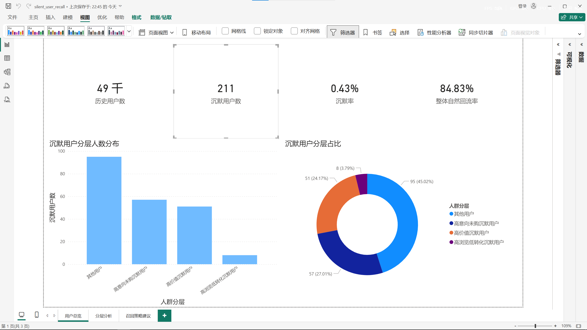
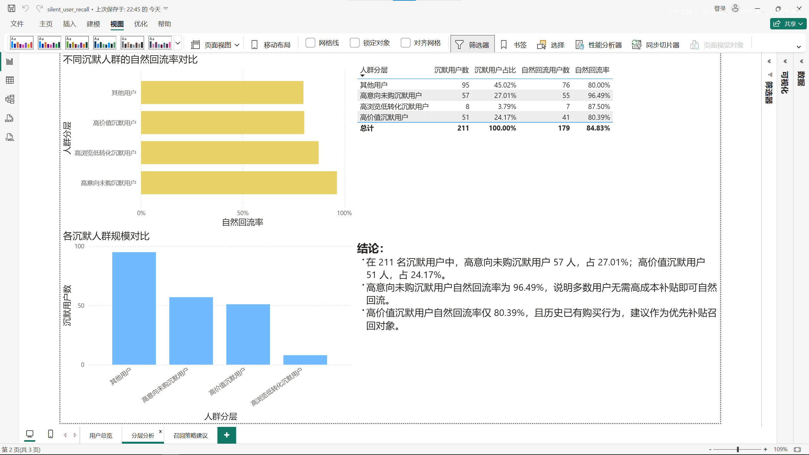
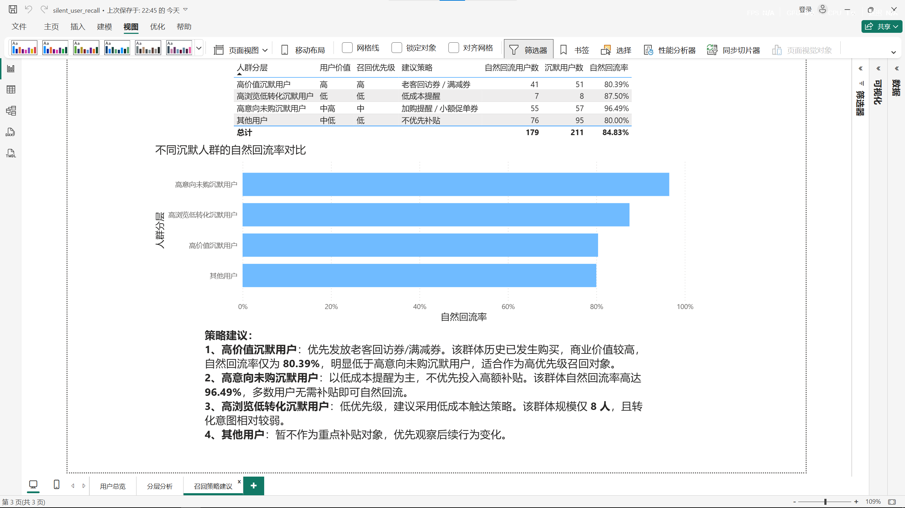

# Silent User Recall Analysis

## Overview
This project explores a practical business question:

**Among users who suddenly become inactive, which group should be prioritized for recall?**

Using e-commerce behavior logs, I identified short-term silent users, grouped them based on historical behavior, and compared their natural return rates to decide which segment was more worth targeting with recall strategies.

## Tools
- MySQL
- Power BI

## What I did
I first worked with a 5% user sample from raw behavior logs and built user-level features from a historical activity window. These features included:
- page views
- cart actions
- favorites
- purchases
- active days
- category coverage

Then I defined a short-term silent window:
- users who were active in the historical window
- but had no activity in the following 2 days

After that, I checked whether these users returned naturally on the next day. I used this natural return rate as a proxy to judge how urgently each group needed intervention.

Finally, I segmented silent users into:
- high-value silent users
- high-intent but not-yet-purchased silent users
- high-browse low-conversion silent users
- others

## Key Results
- Analyzed **4,997,202** behavior records
- Identified **49,335** historical users
- Found **211** short-term silent users
- Silent rate: **0.43%**
- Overall natural return rate: **84.83%**

### Silent user breakdown
- Others: **95** users (**45.02%**)
- High-intent but not-yet-purchased silent users: **57** users (**27.01%**)
- High-value silent users: **51** users (**24.17%**)
- High-browse low-conversion silent users: **8** users (**3.79%**)

### Natural return rate by segment
- Others: **80.00%**
- High-value silent users: **80.39%**
- High-browse low-conversion silent users: **87.50%**
- High-intent but not-yet-purchased silent users: **96.49%**

## Main Insight
The most interesting finding was that the users with the strongest apparent purchase intent were **not** the best group to prioritize for coupon-based recall.

Although high-intent silent users showed strong intent signals such as cart or favorite behavior, their natural return rate was already very high (**96.49%**). In other words, many of them were likely to come back even without expensive incentives.

By contrast, high-value silent users had already made purchases before and showed a lower natural return rate (**80.39%**), which made them a better target for priority recall.

## Business Recommendation
- **Prioritize high-value silent users** for coupon-based recall
- Use **lighter-touch reminders** for high-intent silent users instead of high-cost incentives
- Keep **high-browse low-conversion users** as a low-priority segment
- Treat the remaining users as a general observation group rather than a primary recall target

## Limitations
This is a short-window analysis rather than a long-term churn study.

Also, since the dataset does not include actual coupon exposure or campaign results, I did not measure true recall uplift. Instead, I used natural return rate as a proxy to estimate which user groups were more likely to need intervention.

## Dashboard Preview

### 1. User Overview

### 2. Segmentation Analysis

### 3. Recall Strategy

## Project Structure
- `dashboard/` — Power BI dashboard file
- `report/` — dashboard screenshots
- `sql/` — core SQL scripts
- `docs/` — supporting notes